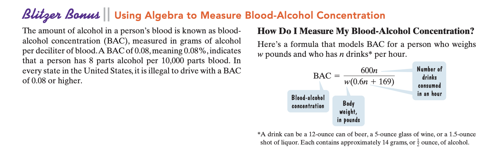

# Blood Alcohol Concentration Project
To help you make safer choices after a ***fun*** night out.

## the original plan
Originally, I planned on using SQL and Tableau to create an interactive
dashboard that has users input their weight and the number of alcoholic
drinks they've had in a night.

Then the dashboard would display two thing:
1. Their blood alcohol concentration
2. Whether or not they can legally drive

I used used some complex SQL queries to create the table housing weights
from 70 to 400 pounds and number of drinks from 0 to 15.

I calculated blood alcohol concentration using a formula found in a math
textbook I read (the Blitzer textbook inspired this project).

And for the "can_you_drive" column, I used the standard US law saying
0.08% bac is the legal limit.

## a little trouble
It didn't take long for me to realize Tableau doesn't support written
inputs. So I couldn't design the dashboard I envisioned. So I adapted and
revisited my good pal Python.

I wrote a script that allows users to input their weight and the number of
drinks they had. Then I print the two things stated above. The code isn't
crazy complex, but this is my first time using python in years.

So it's a good refresher and test of what I can and **can't** do.

Sadly I couldn't recreate the dashboard in a visual appealing way, but
the logic and backend results I wanted are here. In the future as I keep
learning Python, I'll probably come back to this project and build an
interactive dashboard for it.

## quick note
My original python code involved using a **while loop** to ensure the inputs
fit in the table's ranges for weight and num_of_drinks.

And if all conditions are met, I used the **else statement** to find the correct
row in the csv and print the values we want. But after finishing the script, I
realized there might be a more efficient way to write the code.

So I went back and rewrote the same script in three different way.

***pycode_1.py*** is the original script I wrote.
***pycode_2.py*** rewrites the script by shortening the while statement.
***pycode_3.py*** shortens the while statement further and uses functions.